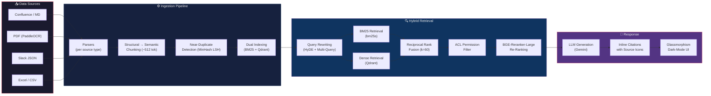
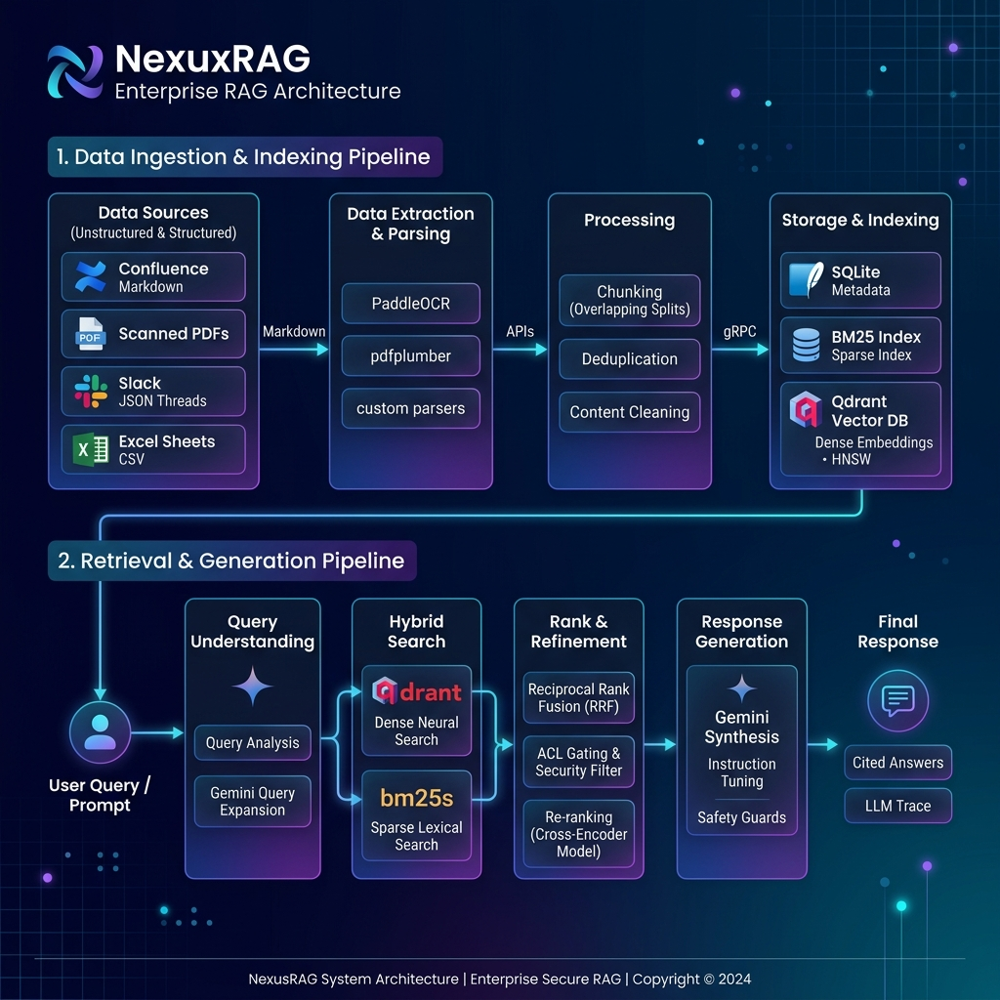

<div align="center">

# 🛡️ NexusRAG — Enterprise RAG Over Multi-Modal Dirty Data

### Production-Grade Enterprise RAG over Messy Documents

[](https://www.python.org/)
[](LICENSE)
[](https://fastapi.tiangolo.com/)
[](https://qdrant.tech/)
[](https://deepmind.google/technologies/gemini/)

[](https://github.com/vansharora156/nexus-rag/commits/main)
[](https://github.com/vansharora156/nexus-rag)
[](https://github.com/vansharora156/nexus-rag/issues)

---

**NexusRAG** is a production-grade Retrieval-Augmented Generation (RAG) system built for the messy reality of enterprise data. It ingests Confluence spaces, structured or scanned PDFs (powered by PaddleOCR), Slack threads, and Excel spreadsheets—normalizes them into unified schema chunks, indexes them into a hybrid search engine, and serves secured, cited answers using Google Gemini.

[Features](#-features) · [Architecture](#-architecture) · [Demo](#-demo) · [Screenshots](#-screenshots) · [Quick Start](#-quick-start) · [Project Structure](#-directory-structure) · [ADRs](#-architecture-decision-records) · [Roadmap](#️-roadmap)

</div>

---

## 🎯 Problem Statement
BigCorp, a global enterprise, has accumulated 15 years of internal knowledge fragmented across Confluence spaces, Slack thread histories, native/scanned PDFs, and Excel spreadsheets. The standard off-the-shelf RAG pipeline fails in this environment due to layout parsing issues on multi-column or scanned documents, loss of conversational context on Slack thread splits, document version duplication, and security group role exposure. **NexusRAG** addresses these challenges by normalizing dirty documents using layout-aware OCR and structured parsers, deduplicating near-identical files with MinHash LSH, running a Reciprocal Rank Fusion (RRF) search across BM25 and dense indices, and enforcing strict document-level Access Control List (ACL) permission filters dynamically at query time.

---

## 🏗️ Architecture



Let's look at the pipeline infographic:


---

## 🎥 Demo

*   **Local UI Access:** [http://localhost:8000/ui](http://localhost:8000/ui) (FastAPI app gateway running locally)

---

## ✨ Features

| | Feature | Description |
|---|---|---|
| 📝 | **Multi-Source Ingestion** | Confluence, PDF with PaddleOCR fallback, Slack JSON threads, Excel/CSV tables — all normalized into a unified chunk schema. |
| 🔍 | **Hybrid Retrieval** | BM25 (via `bm25s`) + dense vectors (Qdrant) merged with Reciprocal Rank Fusion (RRF) for best-of-both-worlds search. |
| 🔒 | **ACL Permission Filtering** | Post-retrieval, pre-reranking access control ensures users only see documents matching their active role (engineering, finance, HR, exec). |
| 🧹 | **Near-Duplicate Detection** | MinHash LSH fingerprinting catches near-duplicate content across sources before it pollutes your index. |
| 📎 | **Inline Citations** | Every answer includes clickable citations with source-type icons (📄 PDF, 💬 Slack, 📊 Excel, 📝 Confluence). |
| 🔄 | **Query Rewriting** | HyDE (Hypothetical Document Embeddings) + multi-query expansion for robust retrieval across terminology gaps. |
| 📊 | **Evaluation Suite** | Ragas-compatible test harness across exact match, semantic, and ACL-filtered queries. |
| 🎨 | **Glassmorphism UI** | Dark-mode interface with frosted-glass cards, smooth animations, and responsive design. |

---

## 🛠️ Tech Stack

| Component | Selected Technology | Main Alternatives | Primary Decision Driver |
|---|---|---|---|
| **LLM Generator** | **Gemini 2.0 Flash / Groq** | OpenAI GPT-4o-mini, Local Llama-3 | Large context window (1M), fast speed, native multimodal features. |
| **Vector DB** | **Qdrant** | ChromaDB, pgvector, Pinecone | Dynamic metadata payload filtering, extreme speed (Rust backend), local execution. |
| **Lexical Search** | **BM25s** | ElasticSearch, Rank-BM25 | Lightweight pure Python implementation, fast token scoring. |
| **OCR Engine** | **PaddleOCR** | Tesseract, EasyOCR | Superior multi-column document layout parsing and table extraction. |
| **Embeddings** | **BAAI/bge-small-en-v1.5** | all-MiniLM-L6-v2, OpenAI | High performance, 512 context limit, local offline execution. |
| **Reranker** | **BGE-Reranker-Large** | ms-marco-MiniLM | Local execution without API dependency, top BEIR/MTEB benchmarks. |
| **Backend API** | **FastAPI** | Flask, Django | High performance, async support, native Pydantic schema validation. |

---

## 📂 Directory Structure

Navigate and explore the folders in this repository:

```
📂 NexusRAG/
├── 📂 data/
│   ├── 📂 excel/
│   ├── 📂 markdown/
│   ├── 📂 pdf/
│   ├── 📂 sample/
│   └── 📂 slack/
├── 📂 docs/
│   ├── 📂 adr/
│   │   ├── 001-vector-db.md
│   │   ├── 002-hybrid-search.md
│   │   ├── 003-ocr-choice.md
│   │   └── 004-permission-model.md
│   ├── architecture.md
│   ├── architecture.png
│   ├── data_sources.md
│   ├── evaluation_plan.md
│   ├── roadmap.md
│   └── tech_stack.md
├── 📂 scripts/
│   ├── evaluate.py
│   ├── generate_data.py
│   └── ingest.py
├── 📂 server/
│   ├── main.py
│   └── routes.py
├── 📂 src/
│   ├── 📂 acl/
│   ├── 📂 chunking/
│   ├── 📂 generation/
│   ├── 📂 indexing/
│   ├── 📂 parsers/
│   ├── 📂 pipeline/
│   └── 📂 retrieval/
└── 📂 tests/
```

- 📂 [**docs/adr/**](docs/adr/) — Architecture Decision Records detailing our design decisions.
- 📂 [**src/**](src/) — End-to-end Python pipeline package:
  - 🛠️ [**src/parsers/**](src/parsers/) — File parsers (PDF with PaddleOCR, Markdown, Slack, Excel).
  - 🧩 [**src/chunking/**](src/chunking/) — Structural-first and semantic-second chunkers.
  - 🧬 [**src/dedup/**](src/dedup/) — MinHash LSH deduplication pipeline.
  - 🗄️ [**src/indexing/**](src/indexing/) — Index managers for Qdrant and BM25.
  - 🔍 [**src/retrieval/**](src/retrieval/) — Hybrid query-rewrite, RRF, and BGE-Reranker-Large module.
  - 🔐 [**src/acl/**](src/acl/) — Role-based ACL verification logic.
  - 💬 [**src/generation/**](src/generation/) — LLM orchestration with Google Gemini SDK.
- 📂 [**server/**](server/) — FastAPI application routing backend and the web UI client assets.
- 📂 [**scripts/**](scripts/) — Ingestion runners, evaluation pipelines, and synthetic data generators.
- 📂 [**tests/**](tests/) — Suite of pytests verifying functionality across components.

---

## 🚀 Quick Start

### 1. Clone & Setup Environment

```bash
git clone https://github.com/vansharora156/nexus-rag.git
cd nexus-rag
python -m venv .venv
source .venv/bin/activate  # On Windows: .venv\Scripts\activate
pip install -r requirements.txt
```

### 2. Configure Environment

Copy `.env.example` to `.env` and fill in your details:

```bash
cp .env.example .env
```

Ensure the following properties are configured:
- **Gemini API Key**: Set your `GEMINI_API_KEY` for response generation.
- **Qdrant Vector Store**:
  - For local runs, set `QDRANT_PATH=./qdrant_storage` (Qdrant will run in-memory or write to disk locally).
  - Alternatively, if you have Qdrant running in Docker or Cloud, use `QDRANT_URL=http://localhost:6333` and comment out `QDRANT_PATH`.

### 3. Run Ingestion Pipeline

Generate mock enterprise documents and ingest them into the hybrid indexes:

```bash
# Generate synthetic multi-modal files (PDFs, Markdown, Excel, Slack logs)
python scripts/generate_data.py

# Parse, chunk, deduplicate, and index all files in Qdrant and BM25
python scripts/ingest.py
```

### 4. Start the Application Server

Launch the API backend and user interface:

```bash
python -m uvicorn api.app:app --reload --port 8000
```

Access the API Swagger documentation at [http://localhost:8000/docs](http://localhost:8000/docs).

### 5. Run Automated Tests

To verify that each layer of the RAG pipeline is working perfectly, run the following automated test scripts:

```bash
# Run ACL security tests
python scripts/day1_test_acl.py

# Run RRF rank fusion and query rewriter tests
python scripts/day2_test_rrf_rewriter.py

# Run hybrid retrieval tests (unlocked Qdrant database)
python scripts/day3_test_hybrid_retrieval.py

# Run generation and citations verification
python scripts/day4_test_generation.py

# Run backend API endpoints verification
python scripts/day6_test_api.py
```

---

## 📊 Data

NexusRAG ingests 4 heterogeneous enterprise data sources to simulate a real corporate workspace. All raw files are located under the `/data` folder, and detailed schemas, extraction paths, and license settings are documented in [docs/data.md](docs/data.md):
*   **Confluence Wiki Pages:** Stored as Markdown files containing metadata frontmatter.
*   **Company Policies and Handbooks:** Stored as native/scanned PDF files (supporting PaddleOCR fallback).
*   **Slack Communication Logs:** Stored as structured thread conversations in JSON blocks.
*   **Department Budgets:** Stored as CSV spreadsheet tables with column headers preserved.

---

## 📋 Architecture Decision Records

We document major technology choices and design patterns using Architecture Decision Records:

| ADR | Title | Description | Status |
|---|---|---|---|
| [**001-vector-db.md**](docs/adr/001-vector-db.md) | Choosing Qdrant over ChromaDB | Opting for Rust-native Qdrant to support payload indexing and production scalability. | ✅ Accepted |
| [**002-hybrid-search.md**](docs/adr/002-hybrid-search.md) | Hybrid BM25 + Dense Qdrant with RRF | Combining BGE-M3 embeddings, bm25s lexical search, RRF fusion, and BGE-Reranker-Large. | ✅ Accepted |
| [**003-ocr-choice.md**](docs/adr/003-ocr-choice.md) | PaddleOCR for Multi-Modal Data | Choosing PP-Structure to support multi-column layout analysis and tabular extraction. | ✅ Accepted |
| [**004-permission-model.md**](docs/adr/004-permission-model.md) | Post-Retrieval ACL Filtering | Filtering out unauthorized chunks after rank fusion and before cross-encoder reranking. | ✅ Accepted |

---

## ⚠️ Known Limitations

1.  **Google Gemini Free-Tier Quota Limit:** The free-tier API has a limit of 15 requests per minute (RPM). Under heavy search concurrency or during first-time database ingestion, you might see warning logs indicating exponential backoff attempts (15s → 30s → 60s). Using the local embedding backend + Groq completion backend bypasses these limits completely.
2.  **Local SQLite Qdrant File Locks on Windows:** The local file-based Qdrant client locks the database directory exclusively. Standalone indexing scripts (like `scripts/ingest.py`) cannot run concurrently while the FastAPI server is actively running. The server must be stopped before executing manual ingestion updates.
3.  **OCR CPU Processing Time:** Running PaddleOCR text/table extraction on legacy scanned documents can take 5–10 seconds per page on a standard CPU. Production environments should utilize GPU resources to accelerate layout analysis.

---

## 🗺️ Roadmap

*   [x] **Core RAG Backend Ingestion:** Native parsers for Markdown, Excel, Slack, and PDF (PaddleOCR) completed.
*   [x] **Hybrid Retrieval & Fusion:** BM25s + Dense Qdrant search fused via Reciprocal Rank Fusion (RRF) and reranked using BGE-Reranker-Large completed.
*   [x] **ACL Security Policy:** Pre-retrieval and post-retrieval role-based permissions filtering completed.
*   [x] **REST API Gateway:** FastAPI endpoints and Swagger diagnostics completed.
*   [x] **Groq & Local Embedding Fallback:** Support for offline BGE embedding models and Groq API Completion integrations completed.
*   [ ] **Interactive UI Dashboard (Next 2 Weeks):** Develop the glassmorphism dark-mode HTML/CSS/JS frontend panel connecting dynamic selectors to user query routes.
*   [ ] **Advanced Table Column Clustering (Next 2 Weeks):** Add semantic group matching to column headers for complex financial sheets.

---

## 🤝 Contributing

We follow standard Git workflows. Ensure you write type hints, document functions/classes, add pytests for any new modules, and update the relevant ADR when modifying design paths.

---

## 📄 License

Distributed under the MIT License. See [LICENSE](LICENSE) for details.

Copyright © 2026 Vansh Arora

Developed as part of the LLM Systems & Applied GenAI Internship.
