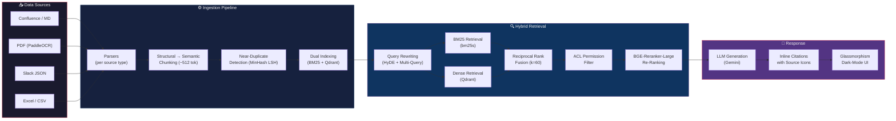

<div align="center">

# 🛡️ NexusRAG — Enterprise RAG Over Multi-Modal Dirty Data

### Production-Grade Enterprise RAG over Messy Documents

[](https://www.python.org/)
[](LICENSE)
[](https://fastapi.tiangolo.com/)
[](https://qdrant.tech/)
[](https://deepmind.google/technologies/gemini/)

---

**NexusRAG** is a production-grade Retrieval-Augmented Generation (RAG) system built for the messy reality of enterprise data. It ingests Confluence spaces, structured or scanned PDFs (powered by PaddleOCR), Slack threads, and Excel spreadsheets—normalizes them into unified schema chunks, indexes them into a hybrid search engine, and serves secured, cited answers using Google Gemini.

[Features](#-features) · [Architecture](#-architecture) · [Quick Start](#-quick-start) · [Project Structure](#-project-structure) · [ADRs](#-architecture-decision-records)

</div>

---

## 🏗️ Architecture



---

## ✨ Features

| | Feature | Description |
|---|---|---|
| 📝 | **Multi-Source Ingestion** | Confluence, PDF with PaddleOCR fallback, Slack JSON threads, Excel/CSV tables — all normalized into a unified chunk schema. |
| 🔍 | **Hybrid Retrieval** | BM25 (via `bm25s`) + dense vectors (Qdrant) merged with Reciprocal Rank Fusion (RRF) for best-of-both-worlds search. |
| 🔒 | **ACL Permission Filtering** | Post-retrieval, pre-reranking access control ensures users only see documents matching their active role (engineering, finance, HR, exec). |
| 🧹 | **Near-Duplicate Detection** | MinHash LSH fingerprinting catches near-duplicate content across sources before it pollutes your index. |
| 📎 | **Inline Citations** | Every answer includes clickable citations with source-type icons (📄 PDF, 💬 Slack, 📊 Excel, 📝 Confluence). |
| 🔄 | **Query Rewriting** | HyDE (Hypothetical Document Embeddings) + multi-query expansion for robust retrieval across terminology gaps. |
| 📊 | **Evaluation Suite** | Ragas-compatible test harness across exact match, semantic, and ACL-filtered queries. |
| 🎨 | **Glassmorphism UI** | Dark-mode interface with frosted-glass cards, smooth animations, and responsive design. |

---

## 📁 Project Structure

Navigate and explore the folders in this repository:

- 📂 [**docs/adr/**](docs/adr/) — Architecture Decision Records detailing our design decisions.
- 📂 [**src/**](src/) — End-to-end Python pipeline package:
  - 🛠️ [**src/parsers/**](src/parsers/) — File parsers (PDF with PaddleOCR, Markdown, Slack, Excel).
  - 🧩 [**src/chunking/**](src/chunking/) — Structural-first and semantic-second chunkers.
  - 🧬 [**src/dedup/**](src/dedup/) — MinHash LSH deduplication pipeline.
  - 🗄️ [**src/indexing/**](src/indexing/) — Index managers for Qdrant and BM25.
  - 🔍 [**src/retrieval/**](src/retrieval/) — Hybrid query-rewrite, RRF, and BGE-Reranker-Large module.
  - 🔐 [**src/acl/**](src/acl/) — Role-based ACL verification logic.
  - 💬 [**src/generation/**](src/generation/) — LLM orchestration with Google Gemini SDK.
- 📂 [**server/**](server/) — FastAPI application routing backend and the web UI client assets.
- 📂 [**scripts/**](scripts/) — Ingestion runners, evaluation pipelines, and synthetic data generators.
- 📂 [**tests/**](tests/) — Suite of pytests verifying functionality across components.
- 📂 [**eval/**](eval/) — Ground-truth questions, citation metrics, and evaluation runners.

---

## 🚀 Quick Start

### 1. Clone & Setup Environment

```bash
git clone https://github.com/your-org/ask-the-company.git
cd ask-the-company
python -m venv .venv
source .venv/bin/activate  # On Windows: .venv\Scripts\activate
pip install -r requirements.txt
```

### 2. Configure Environment

Copy `.env.example` to `.env` and fill in your details:

```bash
cp .env.example .env
```

Ensure the following properties are configured:
- **Gemini API Key**: Set your `GEMINI_API_KEY` for response generation.
- **Qdrant Vector Store**:
  - For local runs without Docker, set `QDRANT_PATH=./qdrant_storage` (Qdrant will run in-memory or write to disk locally).
  - Alternatively, if you have Qdrant running in Docker or Cloud, use `QDRANT_URL=http://localhost:6333` and comment out `QDRANT_PATH`.

### 3. Run Ingestion Pipeline

Generate mock enterprise documents and ingest them into the hybrid indexes:

```bash
# Generate synthetic multi-modal files (PDFs, Markdown, Excel, Slack logs)
python scripts/generate_data.py

# Parse, chunk, deduplicate, and index all files in Qdrant and BM25
python scripts/ingest.py
```

### 4. Start the Application Server

Launch the API backend and user interface:

```bash
python -m uvicorn server.main:app --reload --port 8000
```

Access the dark-mode glassmorphism interface at [http://localhost:8000](http://localhost:8000).

---

## 📋 Architecture Decision Records

We document major technology choices and design patterns using Architecture Decision Records:

| ADR | Title | Description | Status |
|---|---|---|---|
| [**001-vector-db.md**](docs/adr/001-vector-db.md) | Choosing Qdrant over ChromaDB | Opting for Rust-native Qdrant to support payload indexing and production scalability. | ✅ Accepted |
| [**002-hybrid-search.md**](docs/adr/002-hybrid-search.md) | Hybrid BM25 + Dense Qdrant with RRF | Combining BGE-M3 embeddings, bm25s lexical search, RRF fusion, and BGE-Reranker-Large. | ✅ Accepted |
| [**003-ocr-choice.md**](docs/adr/003-ocr-choice.md) | PaddleOCR for Multi-Modal Data | Choosing PP-Structure to support multi-column layout analysis and tabular extraction. | ✅ Accepted |
| [**004-permission-model.md**](docs/adr/004-permission-model.md) | Post-Retrieval ACL Filtering | Filtering out unauthorized chunks after rank fusion and before cross-encoder reranking. | ✅ Accepted |

---

## 🤝 Contributing

We follow standard Git workflows. Ensure you write type hints, document functions/classes, add pytests for any new modules, and update the relevant ADR when modifying design paths.

---

## 📄 License

Distributed under the MIT License. See [LICENSE](LICENSE) for details.

Copyright © 2026 BigCorp Engineering.
