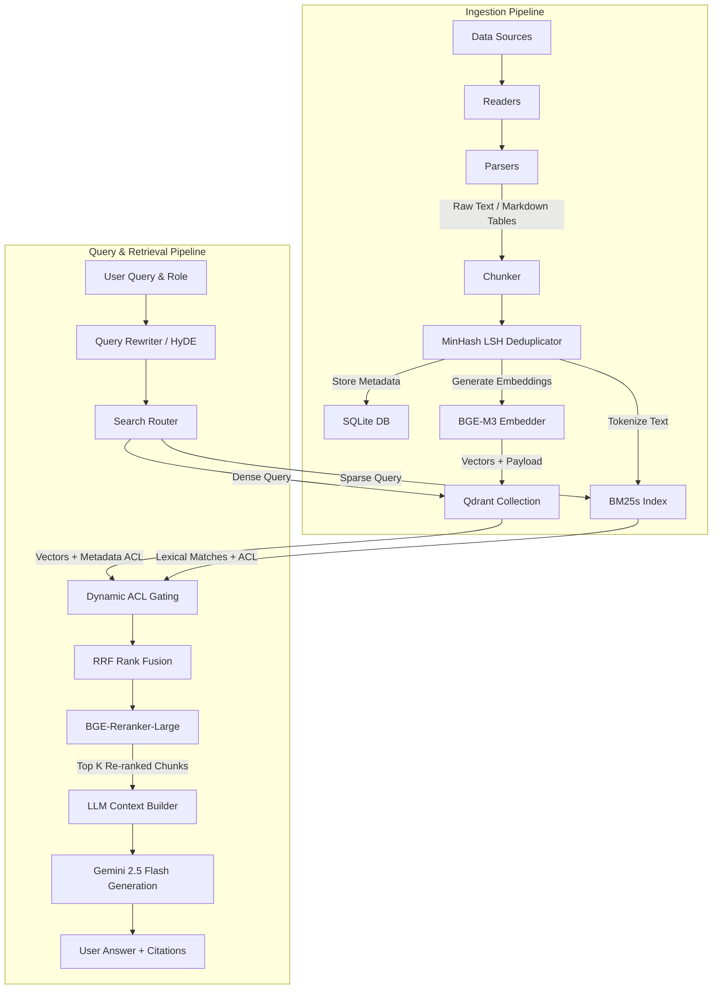

# Initial Design Document: NexusRAG Enterprise Search System

This document outlines the architecture, data flows, components, and project lifecycle for **NexusRAG**, an enterprise retrieval-augmented generation platform for BigCorp.

---

## 1. Requirements Specifications

### 1.1 Functional Requirements (FR)
*   **Multi-Source Ingestion:** Ingest from four core source types:
    *   **Confluence:** Process Markdown files containing page structure, page IDs, and space identifiers.
    *   **PDF Documents:** Extensible parser supporting both text-based PDFs (using layout extraction) and scanned PDFs (using OCR).
    *   **Slack Message Threads:** Reconstruct conversation trees from JSON exports, identifying parent messages, child replies, users, and channels.
    *   **Excel & CSV Spreadsheets:** Ingest tabular data without losing cell formatting, row relationships, or metadata.
*   **Tabular Data Extraction:** Convert document tables into standardized markdown table formats during parsing.
*   **Dual-Path Retrieval:**
    *   **Sparse Retrieval:** BM25 lexical search over tokenized documents using the `bm25s` library.
    *   **Dense Retrieval:** Vector search using `BGE-M3` multi-lingual embeddings indexed in `Qdrant`.
*   **Reciprocal Rank Fusion (RRF):** Combine scores from sparse and dense search paths.
*   **Cross-Encoder Reranking:** Re-score top candidates using `BGE-Reranker-Large` to filter out low-relevance results before LLM feeding.
*   **Dynamic Access Control (ACL) Filtering:** Restrict search results dynamically at query time based on user groups (e.g., HR, Finance, Engineering, Admin) by passing filter criteria directly into Qdrant/SQLite.
*   **MinHash LSH Deduplication:** Compute Jaccard similarity between document text during ingestion. Deduplicate files with >85% similarity, linking variants together.
*   **Inline Citations:** Force the LLM to output footnotes (e.g., `[Doc A, Chunk 3]`) mapped to the actual retrieved chunks.

### 1.2 Non-Functional Requirements (NFR)
*   **Query Latency:** End-to-end user query latency must be under **3 seconds** (excluding the initial ingestion/OCR phases).
*   **Security (Zero Leakage):** The system must achieve **100% compliance** with permission boundaries. Under no circumstances should an unauthorized role retrieve text or metadata from a restricted document.
*   **Citation Precision:** Every citation returned by the system must exist in the retrieved context and verify the generated claim.
*   **Local Deployment:** The complete stack (FastAPI, Qdrant, SQLite, OCR/embeddings) must run locally or in dockerized containers for developer ease.

---

## 2. Target Users & Access Groups
BigCorp defines five primary employee personas. NexusRAG applies ACL restrictions at the space/folder/channel level based on these groups:

| Role | Space Access / Permissions |
| :--- | :--- |
| **Exec** | Access to all spaces (Exec, Finance, HR, Engineering, Product). |
| **HR** | Access to HR, Product, and Engineering. No Executive or Finance access. |
| **Finance** | Access to Finance, Product, and Engineering. No Executive or HR access. |
| **Product** | Access to Product and Engineering spaces. |
| **Engineering** | Access to Engineering and Product spaces. |

---

## 3. Proposed System Architecture

### 3.1 Architectural Block Diagram



### 3.2 Component Breakdown

1.  **Ingestion & Parsing:**
    *   `PaddleOCR` detects layouts and transcribes scan-only text block by block.
    *   `pdfplumber` extracts tables and clean text from native PDFs.
    *   `openpyxl` / `pandas` read spreadsheet tabs, preserving sheet structures as markdown tables.
2.  **Chunker & Deduplicator:**
    *   *Hierarchical Chunker* splits text respecting headings (`#`, `##`, `###`), preserving table blocks as single structural units.
    *   *MinHash Deduplicator* computes hashes of 5-grams. LSH buckets group similar files. The pipeline only indices the newest document version but stores pointers to other variants.
3.  **Storage Layer:**
    *   *Qdrant* handles dense vectors (1024-dim BGE-M3) and metadata payload.
    *   *bm25s* keeps a fast sparse index in memory, persisted as binary files.
    *   *SQLite* maps raw documents, ACLs, MinHash values, and system logs.
4.  **Retrieval Engine:**
    *   *HyDE (Hypothetical Document Embeddings)* rewrite step creates a pseudo-answer using Gemini 2.5 Flash.
    *   *Rank Fusion* combines the dense and sparse outputs using RRF scores.
    *   *Dynamic Gating* uses user metadata roles to supply filter conditions: `Filter(user_role IN doc_acl_groups)`.
5.  **Reranking & LLM generation:**
    *   *BGE-Reranker-Large* calculates semantic alignment scores, selecting the top 5-7 chunks.
    *   *Gemini 2.5 Flash* generates the final response using a system prompt that mandates strict adherence to context and inline citations.

---

## 4. Risks & Mitigations

> [!WARNING]
> Below are key risks and technical mitigations planned for the system.

*   **Risk 1: Table distortion in text format.**
    *   *Description:* Spreadsheets flattened into lists of values lose cross-cell relationships, causing the LLM to misinterpret numbers.
    *   *Mitigation:* NexusRAG converts tables into clean Markdown tables during parsing. For large tables, it chunks them row-wise with column headers prepended to every chunk.
*   **Risk 2: Heavy OCR Processing Latency.**
    *   *Description:* Running PaddleOCR on 100-page scanned documents takes minutes, stalling ingestion pipelines.
    *   *Mitigation:* Ingestion employs file-hashing (MD5). Unchanged files bypass parsing entirely. Large OCR workloads run asynchronously using background processes.
*   **Risk 3: API Token Costs.**
    *   *Description:* Query expansion, HyDE, and long contexts quickly exhaust Gemini 2.5 Flash API quotas.
    *   *Mitigation:* Cache frequently accessed LLM responses and make use of Gemini 2.5 Flash's cost-efficient context caching where applicable. Keep retrieval contexts tight (< 8,000 tokens).

---

## 5. Project Timeline (4-Week Implementation Plan)

```
W1: [Foundations & Ingestion] =======>
W2: [Chunking, Deduplication, Indexing] =======>
W3: [Retrieval, ACL Gating, LLM Synthesis] =======>
W4: [FastAPI, Vite UI, Evaluation Suite] =======>
```

*   **Week 1: Foundations & Ingestion**
    *   Set up SQLite schema and folder structures.
    *   Implement Parsers: Slack thread assembler, spreadsheet markdown converter, PDF/OCR pipeline.
*   **Week 2: Chunking, Deduplication, Indexing**
    *   Implement structural Chunker.
    *   Implement MinHash LSH deduplication logic.
    *   Configure Qdrant collections and persist the sparse BM25s index.
*   **Week 3: Retrieval, ACL Gating, LLM Synthesis**
    *   Build the hybrid retrieval pipeline (Dense + Sparse + RRF).
    *   Implement database ACL filtering logic.
    *   Add BGE-Reranker-Large and configure the Gemini 2.5 prompt pipeline with citations.
*   **Week 4: API, UI, and Evaluation**
    *   Build the FastAPI server exposing query, ingestion status, and ACL verification endpoints.
    *   Build the Vite + Vanilla JS web interface.
    *   Create the 100-question golden dataset and run automated latency, security, and quality tests.
